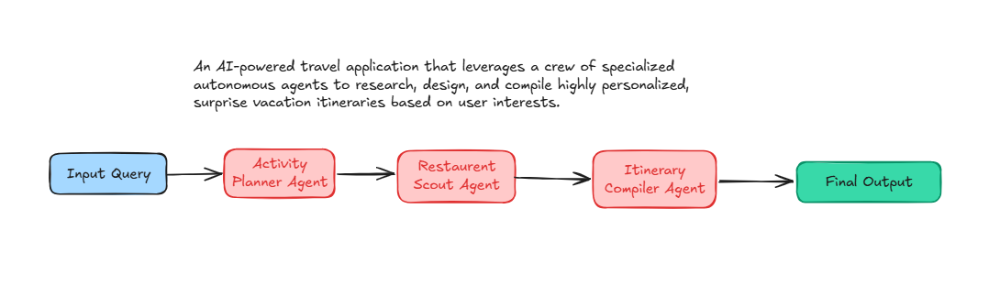
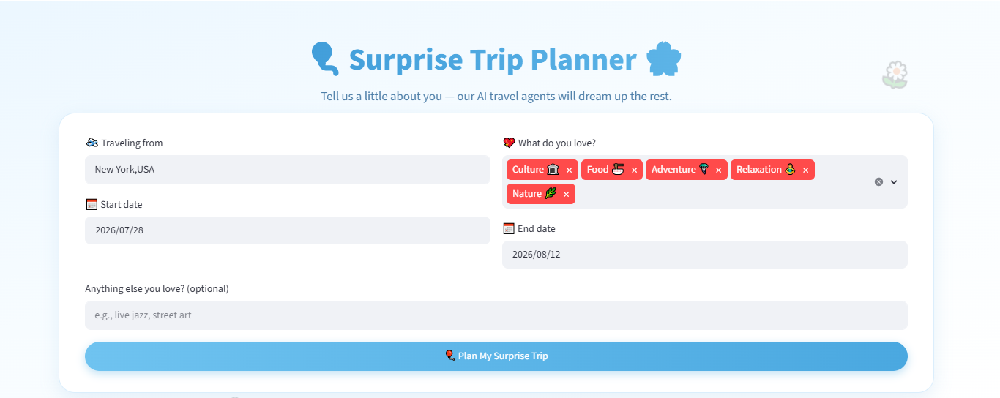

# 🎈 Surprise Trip Planner 🌸

**Surprise Trip Planner**, a smart, multi-agent AI travel planning assistant designed to craft the perfect surprise vacation itinerary based on your departure location, dates, and personal interests. 

This project consists of both an interactive **Streamlit Web Application** and a **Command Line Interface (CLI)**

> [!NOTE]
> This Streamlit app was generated by Claude.
> `main.py` is written by me

---

## 🚀 Features

- **Multi-Agent AI Collaboration**: Uses three dedicated CrewAI agents cooperating sequentially to plan your activities, scout restaurants, and compile the final itinerary.
- **Dynamic Web Interface**: A beautifully stylized Streamlit app featuring light blue gradients, floating balloon/flower animations, and responsive containers.
- **Smart Packing Checklist**: Automatically generates a custom packing list based on your chosen interests (e.g., Beach, Hiking, Nightlife) with tick-off checklist features.
- **Real-Time Countdown**: Computes and displays a live countdown timer showing the days remaining until your surprise departure.
- **Downloadable Itineraries**: Allows downloading the generated surprise travel itinerary in both Markdown (`.md`) and Text (`.txt`) formats.

---

## 🤖 AI Crew Architecture

The core logic utilizes a sequential **CrewAI** workflow consisting of three expert agents:

1. **Personalized Activity Planner**: Analyzes traveler preferences, origins, and dates to suggest 3 surprise destinations, pick the best one, and list 5 custom activities.
2. **Restaurant & Scenic Location Scout**: Explores and selects 3 top-rated/hidden-gem restaurants and 2 scenic spots tailored to the traveler's interests.
3. **Itinerary Compiler**: Takes all suggestions and compiles a detailed day-by-day travel itinerary document minimizing travel friction.
4. 
---

## Project Screen Shot



## 🛠️ Setup & Installation

### Prerequisites

Ensure you have **Python 3.10+** installed on your system.

### 1. Clone or Navigate to the Directory
Open your terminal and navigate to the project directory:
```bash
cd f:/Courses/CrewAI/TripPlanner
```

### 2. Create and Activate a Virtual Environment (Recommended)
```bash
# Create environment
python -m venv venv

# Activate on Windows (PowerShell)
.\venv\Scripts\Activate.ps1

# Activate on macOS/Linux
source venv/bin/activate
```

### 3. Install Dependencies
Install all required libraries using the provided `requirements.txt`:
```bash
pip install -r requirements.txt
```

---

## 🔑 API Configuration

The application requires two external APIs to operate:
1. **OpenRouter API Key** (for accessing the Nemotron LLM model): Get one at [OpenRouter](https://openrouter.ai/keys).
2. **Serper API Key** (for Google search tools used by agents to find real-time locations and reviews): Get one at [Serper.dev](https://serper.dev).

### Environment Variables
You can configure these keys in two ways:

#### Option A: Using a `.env` File
Create a `.env` file in the root directory (or edit the existing one) with the following structure:
```env
OPENROUTER_API_KEY=your_openrouter_api_key_here
SERPER_API_KEY=your_serper_api_key_here
```

#### Option B: Sidebar Configuration (Streamlit App Only)
When running the Streamlit app, you can paste your API keys directly into the password fields in the left sidebar. These keys are only stored in memory for the active session and are never written to disk.

---

## 🏃 How to Run

### Run the Web Interface (Streamlit)
To launch the interactive dashboard:
```bash
streamlit run app.py
```
This will automatically open a tab in your default browser (usually at `http://localhost:8501`).

### Run the CLI Interface (Terminal)
If you prefer running the crew directly in your command line:
```bash
python main.py
```
You will be prompted to enter your travel location, travel dates, and interests in the terminal prompt.

---

## 📄 Important Note

- This Streamlit app was generated by **Claude**.
- `main.py` is written by me
