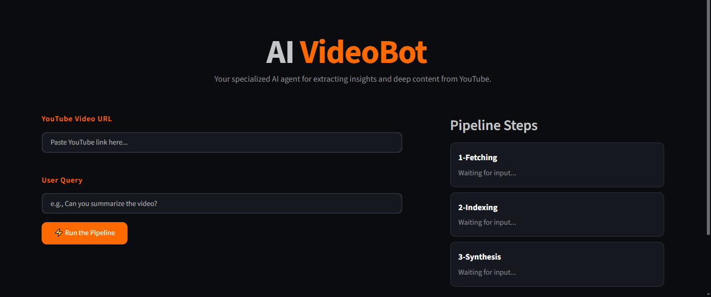

# YouTubeChatbot

AI VideoBot is a Streamlit application that extracts YouTube transcripts, builds a vector index, and answers user queries using LangChain and modern embedding/LLM providers.



## Features

- Paste a YouTube video URL
- Enter a question or query about the video
- Fetch video transcript using `youtube-transcript-api`
- Split transcript text into chunks with `langchain_text_splitters`
- Create embeddings and store them in a FAISS vector store
- Query the indexed transcript with an LLM
- Display pipeline progress and AI output in a styled Streamlit UI

## Requirements

Install dependencies from the project `requirements.txt`:

```bash
pip install -r requirements.txt
```

## Usage

Run the app from the `YouTubeChatbot` directory:

```bash
streamlit run app.py
```

## Environment

Create a `.env` file and set any required environment variables, such as API credentials used by LangChain providers.

## Notes

- The app uses `dotenv` to load environment variables.
- If transcript fetching fails, the UI displays an error message.
- The screenshot file is included as `Screenshot.png`.

## Important Note
- Interface AI generated and `main.py` is written by me
